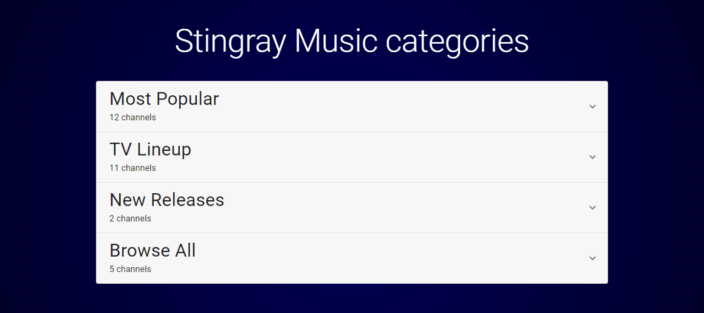
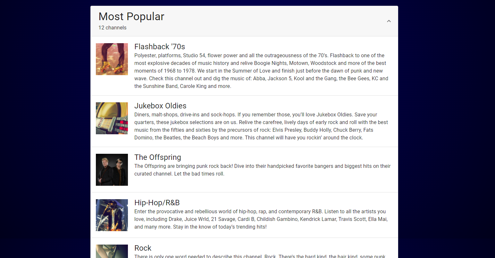
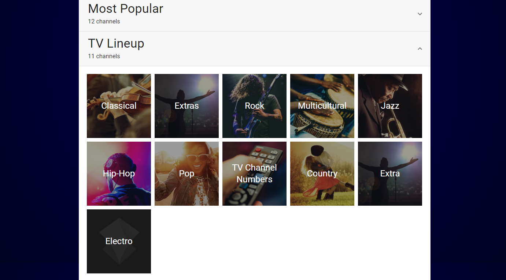

# Stingray technical test
Create a simple app which will display a list of music channels and make them sortable. 

## Requirements
- Populate the application content using the API.
- Display a list of the different swimlanes (categories) received from the API
    - The swimlanes should be displayed in an accordion style view
    - When an accordion is opened any other opened accordions should close
    - When clicking on a swimlane accordion, it should expand with an animation to reveal the content inside it
    - There should be an animated chevron which opens and closes with an animation when the accordion is open and closed
    - The accordion element should have a hover state which indicates when the section is hovered
- Display the swimlane items when opening the swimlane accordion
    - If the swimlane is of type `CHANNEL`, display the channels in a list style view
        - The channel list item should contain the cover image, the label as well as the description
        - The channel list item should have a hover state which indicates when the item is hovered
    - If the swimlane is of type `LINK`, display the links in a grid fashion
        - The link grid item should be an image with a semi-transparent black cover over it. The description should appear in white text centered over the image
        - The link grid item should have a hover state which indicates when the item is hovered
- Responsiveness - Support Mobile/Tablet/Desktop views.
- **Do not use any external libraries/components** with the exceptions of frameworks/core components (React, Angular, JQuery, Redux, SASS, etc). The goal is the assess your coding ability, not your integration skill. So using a library such as bootstrap or a widget like a carousel is not permitted.

### Optional
These optional ideas are to further test your ability to code and are not mandatory. Show off your skills and get creative
- Animation - Add your own animations to make it snazzy
- Docker - Create a Dockerfile containing your whole project and ready to run.
- Node.js - Play with the api and add another endpoint or modify the existing endpoint
- Next.js - Show off your Next.js skills by using tools such as static generation or the image component
- SCSS - Show your advanced css skills. Use mixins, functions or other Sass features


## API 
An API has been provided inside the project that you can use to query the data to display from.    
The API endpoint to get the swimlane and channel data is `http://localhost:3001/api/swimlanes`.  

Instructions on how to run the API can be found in the Getting Started section below. 


## Design
The screenshots provided below are simply a guide as to what the application could look like. It does not need to look identical. Add your own twist if you would like. 

#### Default view


#### Channel list


#### Link grid



## Getting Started
### Running the API
In a separate command line terminal run the following commands: 
```Shell
cd api
npm install
npm start
```

The API will be available at `http://localhost:3001`

## Sending your test

Bundle your code into a `.zip` file and upload it to `https://wetransfer.com/`. Send an email with the link to the We Transfer download.   
**-- OR --**  
Upload it to your public Github and email us a link to the repository on your Github. 

**DO NOT** send a `.zip` file directly as our anti-phishing software will block your email and thus, will not receive your submission. 

## Feedback

If you have comment about this test, do not be shy and give us your feedback.

